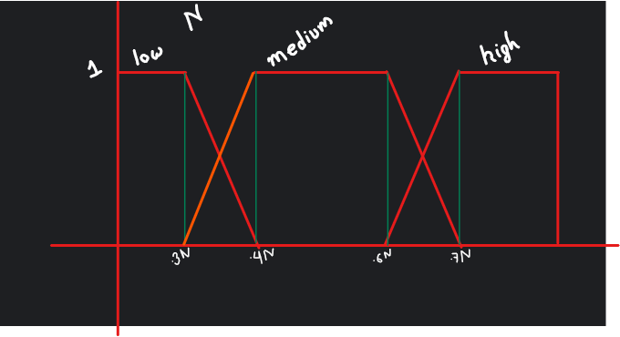
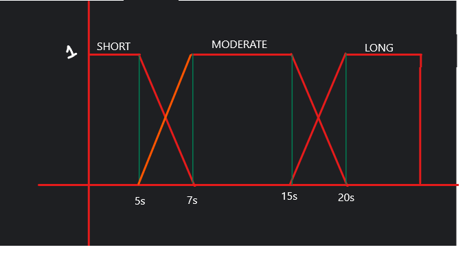
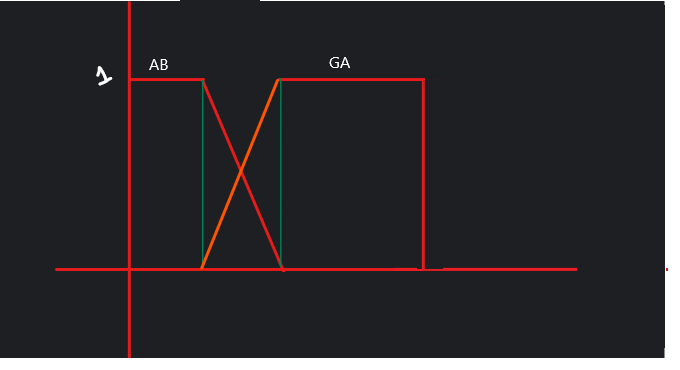

## Fuzzy part

### Input Variables:
- `no_of_empty_cells`: `low`, `medium`, `high`
- `alpha_beta_time`: `short`, `moderate`, `long`

### Output Variable:
- `algo_type`: GA, AB

### Fuzzy Rules:
- If `no_of_empty_cells` is HIGH, then `algo_type` is GA.
- If (`no_of_empty_cells` is LOW OR `no_of_empty_cells` is medium) AND `alpha_beta_time` is LONG, then `algo_type` is GA.
- If `no_of_empty_cells` is not high AND `alpha_beta_time` is not long then `algo_type` is AB.

### Fuzzification:
- `no_of_empty_cell`:

- `alpha_beta_time`:

- `algo_type`: 

### Rules evaluation
- 1st rule:
  - GA1 = `no_of_empty_cells[HIGH]`
- 2nd rule:
  - GA2 = max( min( `no_of_empty_cells[LOW]`,  `no_of_empty_cells[MEDIUM]`), `alpha_beta_time[LONG]` )
- 3rd rule:
  - AB = max( 
      min( `no_of_empty_cells[LOW]`, `no_of_empty_cells[MEDIUM]`), 
      min( `alpha_beta_time[SHORT]`, `alpha_beta_time[MODERATE]` )
    )
- Final:
  - GA = (GA1 + GA2)/2
  - AB = AB
### Aggregation of rules output
- By taking average if there is multiple values of same output
### Defuzzification
- Using COG
